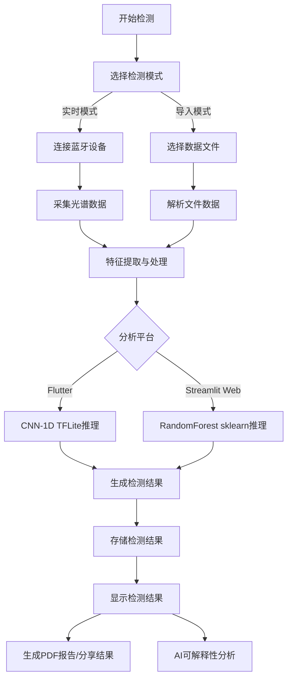
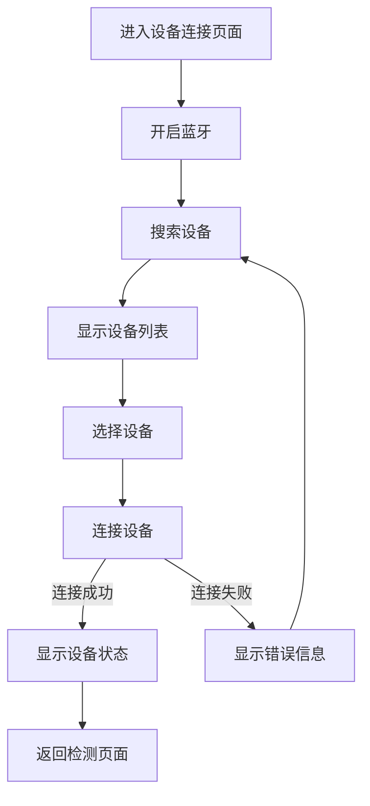
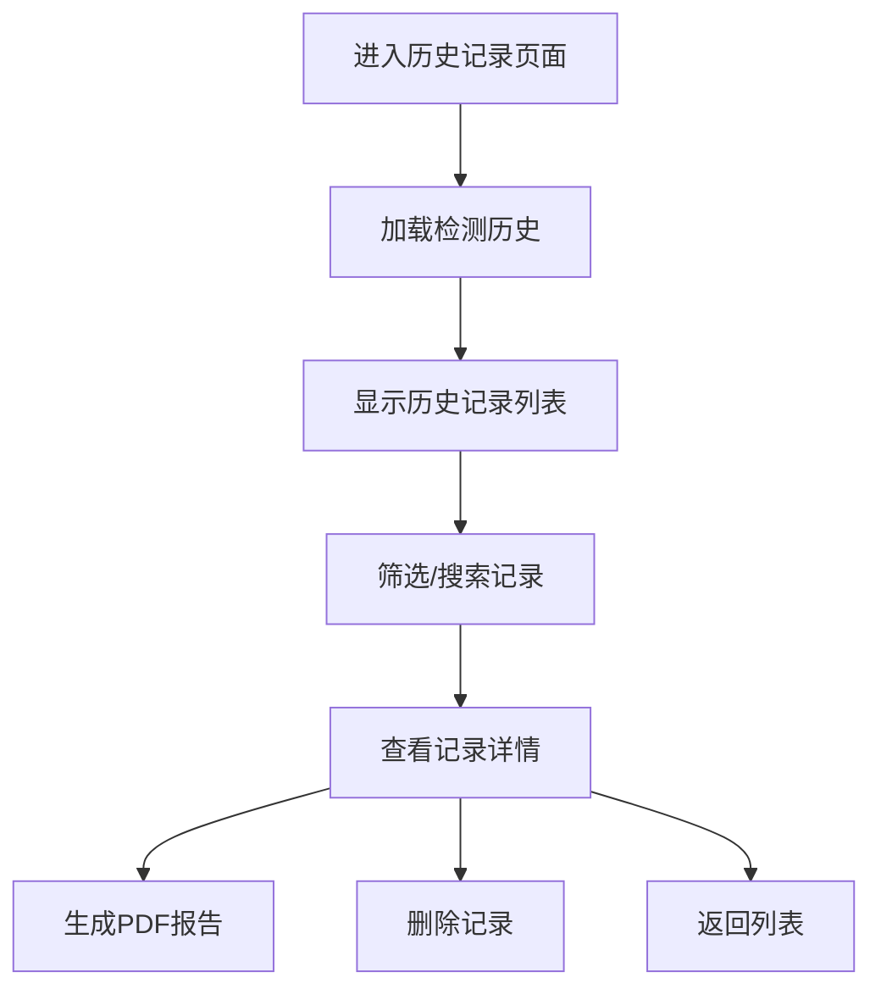

# 农药残留检测APP 架构设计文档

## 1. 系统架构概述

农药残留检测APP采用分层架构设计，基于Flutter框架构建，主要分为以下几层：

- **表现层（Presentation Layer）**：负责用户界面的展示和用户交互
- **业务逻辑层（Business Logic Layer）**：负责处理核心业务逻辑
- **数据服务层（Data Service Layer）**：负责数据的存储、获取和处理
- **设备交互层（Device Interaction Layer）**：负责与外部设备的通信
- **机器学习层（Machine Learning Layer）**：负责光谱数据的分析和农药残留检测（Flutter端使用TFLite CNN，Streamlit Web端使用sklearn RandomForest）

这种分层架构设计使得系统各部分职责清晰，耦合度低，便于维护和扩展。

## 2. 模块划分与职责

### 2.1 表现层（Presentation Layer）

表现层主要由`screens`和`widgets`目录组成，负责用户界面的展示和用户交互。

#### 核心页面

- **HomeScreen**：应用的主界面，显示设备状态、检测统计和最近检测记录
- **DetectionScreen**：核心检测页面，包含样品信息输入、检测模式选择、光谱数据显示和检测结果展示
- **DeviceConnectionScreen**：设备连接页面，用于搜索和连接蓝牙检测设备
- **HistoryScreen**：历史记录页面，显示和管理检测历史
- **SettingsScreen**：设置页面，用于配置应用的各项参数

#### 通用组件

- **CommonWidgets**：通用的UI组件，如按钮、卡片、加载指示器等
- **SpectralChart**：光谱数据图表组件
- **ResultCard**：检测结果卡片组件
- **RiskRadarChart**：风险雷达图组件
- **ExplainabilityWidgets**：AI可解释性相关组件

### 2.2 业务逻辑层（Business Logic Layer）

业务逻辑层主要由`providers`目录组成，负责处理核心业务逻辑和状态管理。

#### 核心Provider

- **AppProvider**：应用全局状态管理，负责用户信息、设备状态、主题设置等
- **DetectionProvider**：检测状态管理，负责检测过程的状态管理和数据流转
- **HistoryProvider**：历史记录管理，负责检测历史的加载、筛选和搜索

### 2.3 数据服务层（Data Service Layer）

数据服务层主要由`services`目录组成，负责数据的存储、获取和处理。

#### 核心服务

- **StorageService**：数据存储服务，负责检测结果、用户信息等数据的本地存储
- **ErrorHandlingService**：错误处理服务，负责全局异常捕获和错误处理
- **SecurityService**：安全服务，负责数据加密和安全存储
- **CloudService**：云服务，负责数据的云端备份和同步
- **ExportService**：导出服务，负责检测结果的导出
- **PdfReportService**：PDF报告服务，负责生成检测报告

### 2.4 设备交互层（Device Interaction Layer）

设备交互层主要由`services`目录中的蓝牙相关服务组成，负责与外部设备的通信。

#### 核心服务

- **BluetoothService**：蓝牙服务，负责搜索、连接蓝牙设备和数据传输
- **DataImportService**：数据导入服务，负责从文件导入光谱数据

### 2.5 机器学习层（Machine Learning Layer）

机器学习层负责光谱数据的分析和农药残留检测，分为两个实现版本：

#### Flutter端（TFLite CNN）

Flutter原生APP使用`ml`目录下的模块，基于TensorFlow Lite进行端侧推理：

- **DeepLearningAnalyzer**：深度学习分析器，使用CNN-1D模型分析光谱数据
- **FeatureEngineer**：特征工程师，负责光谱数据的特征提取和处理
- **ModelManager**：模型管理器，负责TFLite模型的加载和管理
- **ExplainabilityService**：AI可解释性服务，负责解释AI分析结果

#### Streamlit Web端（sklearn RandomForest）

Streamlit Web版使用scikit-learn RandomForest替代CNN，主要模块：

- **RandomForestClassifier**：100棵决策树的分类器（11类农药），使用`predict_proba`获取真实置信度
- **RandomForestRegressor**：100棵决策树的回归器（10种浓度预测）
- **合成训练数据生成**：基于PESTICIDE_PEAKS物理参数内部生成约2000条训练光谱（`np.random.RandomState(42)`确保确定性）
- **基于扰动的SHAP**：16段光谱置零扰动 → RF预测 → 梯度符号分配（确定性，无随机数）
- **Gini特征重要性**：直接使用`rf_clf.feature_importances_`
- **RF树方差置信区间**：基于`np.std([tree.predict_proba(X) for tree in rf_clf.estimators_])`的真实统计置信区间
- **自适应融合权重**：混合模式使用`conf²`二次加权替代硬编码0.7/0.3
- **`@st.cache_resource`缓存**：RF模型仅在Streamlit服务器实例首次启动时训练一次

## 3. 数据流与交互

### 3.1 实时检测数据流

1. **数据采集**：`BluetoothService`通过蓝牙连接检测设备，实时采集光谱数据
2. **数据传输**：采集的光谱数据通过流（Stream）传输到`DetectionScreen`
3. **数据处理**：`FeatureEngineer`对光谱数据进行特征提取和处理
4. **模型分析**：Flutter端使用`DeepLearningAnalyzer`（CNN-1D），Streamlit Web端使用`random_forest_analyze()`（sklearn RF）
5. **结果生成**：生成检测结果，包括风险等级、置信度和检出的农药
6. **结果存储**：`StorageService`将检测结果存储到本地数据库
7. **结果展示**：`DetectionScreen`显示检测结果，用户可以查看详细信息

### 3.2 数据导入检测数据流

1. **文件选择**：用户在`DetectionScreen`选择光谱数据文件
2. **数据解析**：`DataImportService`解析文件，提取光谱数据
3. **数据验证**：验证数据的有效性和格式
4. **数据处理**：`FeatureEngineer`对光谱数据进行特征提取和处理
5. **模型分析**：Flutter端使用CNN-1D，Streamlit Web端使用RandomForest分析处理后的数据
6. **结果生成**：生成检测结果
7. **结果存储**：`StorageService`将检测结果存储到本地数据库
8. **结果展示**：`DetectionScreen`显示检测结果

> **注意**：Streamlit Web版已移除"模拟检测"模式，仅保留"数据导入"和"实时检测"两种模式。

## 4. 核心流程图

### 4.1 检测流程

### 4.2 设备连接流程

### 4.3 历史记录流程

## 5. 技术实现细节

### 5.1 状态管理

应用使用Provider进行状态管理，主要实现以下功能：

- **全局状态**：通过`AppProvider`管理应用的全局状态，如用户信息、设备状态、主题设置等
- **检测状态**：通过`DetectionProvider`管理检测过程的状态，如检测进度、当前状态、检测结果等
- **历史记录状态**：通过`HistoryProvider`管理历史记录的状态，如记录列表、筛选条件、搜索结果等

### 5.2 数据存储

应用使用多种存储方式，满足不同数据的存储需求：

- **Hive**：轻量级键值存储，用于存储用户信息、主题设置等小型数据
- **SQLite**：关系型数据库，用于存储检测历史等结构化数据
- **文件系统**：用于存储深度学习模型文件、PDF报告等大型文件

### 5.3 蓝牙通信

应用使用flutter_blue_plus库实现蓝牙通信，主要功能包括：

- **设备搜索**：搜索附近的蓝牙设备
- **设备连接**：连接选定的蓝牙设备
- **数据传输**：接收设备发送的光谱数据
- **设备状态监控**：监控设备的连接状态和电池电量
- **自动重连**：设备断开连接后自动尝试重连

### 5.4 机器学习

应用在不同平台使用不同的机器学习方案：

#### Flutter端 - TensorFlow Lite

- **模型加载**：加载预训练的CNN-1D TFLite模型
- **数据预处理**：对光谱数据进行预处理，如特征提取、标准化等
- **模型推理**：使用TFLite模型对预处理后的数据进行分析
- **结果后处理**：对模型输出进行后处理，生成最终的检测结果
- **模型管理**：管理模型的版本和缓存

#### Streamlit Web端 - scikit-learn RandomForest

- **合成数据训练**：基于PESTICIDE_PEAKS物理参数生成约2000条训练光谱，训练RF分类器和回归器
- **模型缓存**：使用`@st.cache_resource`确保模型仅训练一次
- **分类推理**：`RandomForestClassifier(n_estimators=100)`，通过`predict_proba`获取真实置信度
- **回归推理**：`RandomForestRegressor(n_estimators=100)`，预测农药浓度
- **混合分析**：规则引擎 + RandomForest自适应融合（`conf²`权重）
- **确定性保证**：`random_state=42`确保训练和推理结果可复现

### 5.5 AI可解释性

应用实现了AI可解释性功能：

#### Flutter端
- **特征重要性分析**：分析不同特征对检测结果的贡献程度
- **SHAP值计算**：计算每个特征的SHAP值，解释模型预测
- **关键波长识别**：识别对检测结果影响最大的波长
- **可视化展示**：通过图表直观展示AI分析的过程和结果

#### Streamlit Web端
- **基于扰动的SHAP**：将光谱分为16段，逐段置零扰动后用RF预测，测量概率变化，按局部梯度幅度分配（确定性，无随机数）
- **Gini特征重要性**：直接使用`rf_clf.feature_importances_`（基于决策树分裂质量的真实重要性）
- **RF树方差置信区间**：基于100棵决策树预测方差计算统计置信区间
- **可视化展示**：通过Plotly交互式图表展示SHAP瀑布图、特征重要性条形图和关键波长高亮

## 6. 系统扩展性

### 6.1 模块扩展

系统设计考虑了模块的扩展性，主要体现在以下方面：

- **插件化设计**：核心功能模块化，便于添加新功能和替换现有功能
- **接口定义**：关键模块通过接口定义，便于实现不同的具体实现
- **依赖注入**：使用依赖注入模式，减少模块间的耦合

### 6.2 设备兼容性

系统设计考虑了设备的兼容性，主要体现在以下方面：

- **设备抽象**：对检测设备进行抽象，便于支持不同类型的设备
- **协议适配**：支持多种蓝牙通信协议，提高设备兼容性
- **数据格式转换**：支持不同格式的光谱数据，便于导入和分析

### 6.3 未来扩展

系统设计预留了未来扩展的空间，主要包括：

- **多设备支持**：支持同时连接和管理多个检测设备
- **云端分析**：支持将数据上传到云端进行更复杂的分析
- **机器学习模型更新**：支持在线更新机器学习模型（Flutter端TFLite模型，Streamlit端RF训练参数）
- **多语言支持**：支持多语言界面和本地化
- **社交分享**：支持将检测结果分享到社交媒体

## 7. 性能优化策略

### 7.1 UI性能优化

- **懒加载**：使用懒加载技术，减少初始加载时间
- **缓存机制**：对频繁使用的数据和组件进行缓存
- **异步渲染**：使用异步渲染，避免UI线程阻塞
- **优化列表**：使用ListView.builder等优化列表渲染

### 7.2 计算性能优化

- **后台计算**：将耗时的计算任务放在后台线程执行
- **批处理**：对批量数据进行批处理，减少计算次数
- **模型优化**：Flutter端对TFLite模型进行量化优化；Streamlit Web端使用`@st.cache_resource`缓存RF模型，避免重复训练
- **内存管理**：合理管理内存使用，避免内存泄漏

### 7.3 网络性能优化

- **数据压缩**：对网络传输的数据进行压缩
- **增量同步**：使用增量同步，减少数据传输量
- **离线模式**：支持离线使用，减少网络依赖
- **网络状态监测**：根据网络状态调整数据传输策略

## 8. 安全性设计

### 8.1 数据安全

- **数据加密**：对敏感数据进行加密存储和传输
- **权限管理**：严格的权限管理，确保只有授权用户能够访问数据
- **数据备份**：定期备份重要数据，防止数据丢失
- **安全审计**：记录关键操作的日志，便于安全审计

### 8.2 代码安全

- **代码混淆**：对发布版本的代码进行混淆，提高安全性
- **漏洞扫描**：定期进行代码漏洞扫描，及时发现和修复安全问题
- **依赖检查**：定期检查依赖库的安全漏洞

### 8.3 设备安全

- **设备认证**：对连接的设备进行认证，防止未授权设备接入
- **通信加密**：对设备通信数据进行加密，防止数据被窃取

## 9. 部署与维护

### 9.1 部署策略

- **多平台部署**：支持Android、iOS和Web平台（Streamlit Cloud部署Web版）
- **应用商店发布**：按照各应用商店的要求进行发布
- **版本管理**：使用语义化版本号，便于版本管理

### 9.2 维护策略

- **日志系统**：实现完善的日志系统，便于问题排查
- **崩溃报告**：集成崩溃报告工具，及时发现和修复崩溃问题
- **用户反馈**：收集用户反馈，持续改进应用
- **定期更新**：定期发布应用更新，修复问题和添加新功能

## 10. 结论

农药残留检测APP采用了分层架构设计，各模块职责清晰，耦合度低，便于维护和扩展。系统实现了核心的农药残留检测功能，包括实时检测和数据导入两种检测模式，同时提供了AI可解释性分析、PDF报告生成等增强功能。

Flutter端使用CNN-1D TFLite模型进行端侧推理，Streamlit Web端使用scikit-learn RandomForest（100棵决策树分类器+回归器）替代CNN进行服务端推理，两个平台的可解释性模块（SHAP、特征重要性、置信区间）均基于真实模型输出，确保分析结果的科学性和可复现性。

通过这种架构设计，应用不仅满足了当前的功能需求，也为未来的扩展预留了空间，能够适应不断变化的技术和业务需求。

---

© 2024 农药残留检测APP. 保留所有权利。
