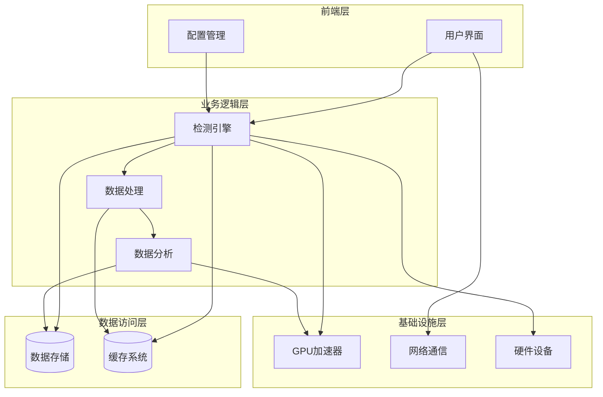
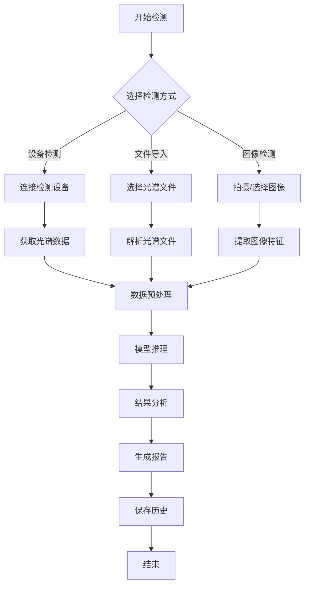
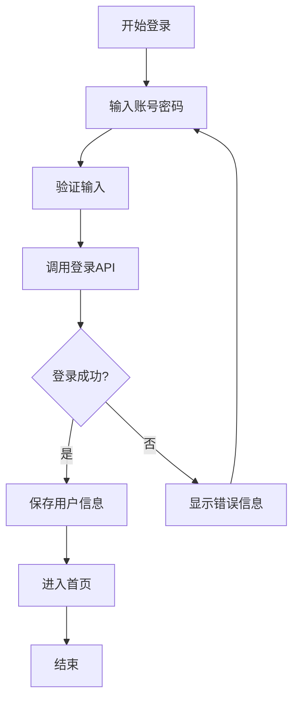

# 顾APP项目开发文档

## 1. 项目背景与概述

### 1.1 项目来源
本项目是基于大学生创新训练计划的重要组成部分，旨在通过先进的技术手段实现对农产品农药残留的智能化检测与识别。项目名称为"顾APP"，寓意"顾念食品安全，守护健康生活"。

### 1.2 项目背景
随着人们生活水平的提高，食品安全问题日益受到关注，其中农药残留是影响食品安全的重要因素之一。传统的农药残留检测方法往往存在效率低、成本高、操作复杂等问题，难以满足日常检测需求。

同时，人工智能技术的快速发展为解决这一问题提供了新的思路。基于深度学习的智能检测系统能够快速、准确地识别农药残留情况，为食品安全保驾护航。

本项目响应国家科技创新发展战略，结合当前技术发展趋势，致力于开发一套高效、准确、稳定的农药残留检测解决方案。

### 1.3 目标用户
- **普通消费者**：关注食品安全，希望了解所购买农产品的农药残留情况
- **农产品检测人员**：需要快速、准确地进行农药残留检测
- **食品安全监管人员**：需要对市场上的农产品进行抽检和监管
- **农产品生产企业**：需要对自身产品进行质量控制

### 1.4 核心价值
- **提升检测效率**：相比传统检测方法，智能检测系统能够大幅提高检测速度
- **提高检测准确性**：基于深度学习的算法模型能够实现高精度的农药残留识别
- **降低检测成本**：减少对专业设备和人员的依赖，降低检测的时间和经济成本
- **促进食品安全**：通过便捷的检测手段，提高公众对食品安全的认知和监督能力
- **推动技术创新**：将人工智能技术应用于食品安全领域，促进相关技术的发展

### 1.5 项目定位
顾APP定位为一款面向普通用户和专业检测人员的农药残留检测工具，通过结合光谱分析技术和深度学习算法，实现对农产品农药残留的快速、准确检测。

## 2. 需求分析

### 2.1 功能需求

#### 2.1.1 核心功能
- **农药残留检测**：通过光谱数据或图像分析，检测农产品中的农药残留情况
- **检测历史记录**：存储和管理用户的检测历史，方便查询和分析
- **设备连接**：支持与光谱检测设备的蓝牙连接，获取实时检测数据
- **数据导入**：支持导入光谱数据文件进行分析
- **检测结果分析**：提供详细的检测结果分析，包括农药种类、残留量、风险等级等
- **PDF报告生成**：生成专业的检测报告，支持分享和打印

#### 2.1.2 辅助功能
- **用户认证**：支持用户注册和登录，实现个性化服务
- **系统设置**：提供应用主题、语言、通知等设置选项
- **模型更新**：支持深度学习模型的在线更新，提高检测准确性
- **性能监控**：监控应用运行状态，确保系统稳定
- **错误处理**：提供友好的错误提示和处理机制

### 2.2 非功能需求

#### 2.2.1 性能需求
- **响应时间**：检测分析响应时间不超过3秒
- **稳定性**：应用崩溃率低于0.1%
- **内存占用**：内存使用不超过设备可用内存的30%
- **电池消耗**：检测过程中的电池消耗不超过5%

#### 2.2.2 安全性需求
- **数据加密**：用户数据和检测结果进行加密存储
- **权限管理**：严格的权限控制，保护用户隐私
- **输入验证**：对所有用户输入进行严格验证，防止恶意输入
- **日志审计**：记录系统操作日志，便于故障排查

#### 2.2.3 可用性需求
- **用户界面**：直观、易用的用户界面，支持浅色和深色模式
- **响应式设计**：适配不同尺寸的设备屏幕
- **离线功能**：核心检测功能支持离线使用
- **多语言支持**：支持中文和英文界面

### 2.3 数据需求

#### 2.3.1 数据类型
- **光谱数据**：农产品的光谱特征数据
- **图像数据**：农产品的图像信息
- **检测结果数据**：农药残留检测结果
- **用户数据**：用户基本信息和偏好设置
- **设备数据**：检测设备的相关信息

#### 2.3.2 数据存储
- **本地存储**：使用Hive和SQLite进行本地数据存储
- **云存储**：支持将检测结果同步到云端

#### 2.3.3 数据处理
- **数据预处理**：对输入数据进行清洗、标准化等处理
- **特征提取**：从原始数据中提取有价值的特征
- **模型训练**：使用处理后的数据训练深度学习模型

## 3. 设计规划

### 3.1 技术架构

#### 3.1.1 整体架构
项目采用分层架构设计，包括前端层、业务逻辑层、数据访问层和基础设施层。



#### 3.1.2 技术栈选择

| 类别 | 技术/框架 | 版本 | 用途 |
|------|-----------|------|------|
| 前端框架 | Flutter | 3.19.0 | 跨平台应用开发 |
| 状态管理 | Provider | 6.1.1 | 应用状态管理 |
| 蓝牙通信 | flutter_blue_plus | 1.31.15 | 设备连接 |
| 网络请求 | Dio | 5.4.0 | API调用 |
| 本地存储 | Hive | 2.2.3 | 轻量级数据存储 |
| 本地存储 | SQLite | 2.3.2 | 结构化数据存储 |
| 数据可视化 | fl_chart | 0.66.0 | 检测结果图表展示 |
| 深度学习 | tflite_flutter | 0.10.4 | 本地模型推理 |
| 权限管理 | permission_handler | 11.0.1 | 设备权限管理 |
| 路径管理 | path_provider | 2.1.1 | 文件路径管理 |
| 序列化 | json_annotation | 4.8.1 | JSON序列化 |
| 图像处理 | image_picker | 1.1.0 | 图像选择和处理 |
| 分享功能 | share_plus | 10.0.0 | 结果分享 |
| 文件选择 | file_picker | 8.0.0 | 文件选择 |
| PDF生成 | pdf | 3.11.0 | 报告生成 |
| PDF打印 | printing | 5.14.2 | 报告打印 |
| 国际化 | intl | 0.20.2 | 多语言支持 |
| 矢量图形 | flutter_svg | 2.0.7 | SVG图标支持 |
| 安全加密 | encrypt | 5.0.3 | 数据加密 |
| 安全存储 | flutter_secure_storage | 9.2.0 | 安全数据存储 |

### 3.2 系统设计

#### 3.2.1 模块划分

| 模块 | 主要职责 | 文件位置 | 核心功能 |
|------|----------|----------|----------|
| 应用核心 | 应用初始化和配置 | lib/main.dart | 应用启动、服务初始化、路由配置 |
| 检测模块 | 农药残留检测 | lib/screens/detection_screen.dart | 检测流程管理、结果展示 |
| 历史模块 | 检测历史管理 | lib/screens/history_screen.dart | 历史记录查询、管理 |
| 设备模块 | 设备连接管理 | lib/screens/device_connection_screen.dart | 蓝牙设备搜索、连接 |
| 用户模块 | 用户认证和管理 | lib/screens/auth/ | 登录、注册、个人信息管理 |
| 设置模块 | 系统设置 | lib/screens/settings_screen.dart | 应用配置、主题设置 |
| 模型管理 | 深度学习模型管理 | lib/ml/model_manager.dart | 模型加载、更新、推理 |
| 数据处理 | 数据预处理和分析 | lib/ml/deep_learning_analyzer.dart | 数据清洗、特征提取、分析 |
| 服务层 | 核心服务 | lib/services/ | 蓝牙、存储、安全等服务 |
| 数据模型 | 数据结构定义 | lib/models/ | 数据实体定义、序列化 |
| 状态管理 | 应用状态管理 | lib/providers/ | 全局状态管理、数据共享 |
| 工具类 | 通用工具 | lib/utils/ | 常量定义、辅助函数 |
| 组件库 | 通用组件 | lib/widgets/ | 可复用UI组件 |

#### 3.2.2 关键流程图

##### 检测流程



##### 用户登录流程



### 3.3 数据库设计

#### 3.3.1 本地数据库

##### 检测历史表 (detection_history)
| 字段名 | 数据类型 | 约束 | 描述 |
|--------|----------|------|------|
| id | INTEGER | PRIMARY KEY AUTOINCREMENT | 检测记录ID |
| timestamp | INTEGER | NOT NULL | 检测时间戳 |
| sample_name | TEXT | NOT NULL | 样品名称 |
| pesticide_name | TEXT | NOT NULL | 农药名称 |
| concentration | REAL | NOT NULL | 残留浓度 |
| risk_level | INTEGER | NOT NULL | 风险等级 |
| spectral_data | BLOB | NULL | 光谱数据 |
| image_path | TEXT | NULL | 图像路径 |
| device_id | TEXT | NULL | 设备ID |
| user_id | INTEGER | NULL | 用户ID |

##### 用户表 (users)
| 字段名 | 数据类型 | 约束 | 描述 |
|--------|----------|------|------|
| id | INTEGER | PRIMARY KEY AUTOINCREMENT | 用户ID |
| username | TEXT | UNIQUE NOT NULL | 用户名 |
| email | TEXT | UNIQUE NOT NULL | 邮箱 |
| password_hash | TEXT | NOT NULL | 密码哈希 |
| created_at | INTEGER | NOT NULL | 创建时间 |
| last_login | INTEGER | NULL | 最后登录时间 |

##### 设备表 (devices)
| 字段名 | 数据类型 | 约束 | 描述 |
|--------|----------|------|------|
| id | INTEGER | PRIMARY KEY AUTOINCREMENT | 设备记录ID |
| device_id | TEXT | UNIQUE NOT NULL | 设备唯一标识 |
| device_name | TEXT | NOT NULL | 设备名称 |
| device_type | TEXT | NOT NULL | 设备类型 |
| last_connected | INTEGER | NULL | 最后连接时间 |
| user_id | INTEGER | NULL | 用户ID |

#### 3.3.2 数据模型定义

```dart
// 检测结果模型
class DetectionResult {
  final String id;
  final DateTime timestamp;
  final String sampleName;
  final String pesticideName;
  final double concentration;
  final int riskLevel;
  final String? spectralDataPath;
  final String? imagePath;
  final String? deviceId;
  
  DetectionResult({
    required this.id,
    required this.timestamp,
    required this.sampleName,
    required this.pesticideName,
    required this.concentration,
    required this.riskLevel,
    this.spectralDataPath,
    this.imagePath,
    this.deviceId,
  });
}

// 用户模型
class User {
  final String id;
  final String username;
  final String email;
  final String? avatar;
  final DateTime createdAt;
  final DateTime? lastLogin;
  
  User({
    required this.id,
    required this.username,
    required this.email,
    this.avatar,
    required this.createdAt,
    this.lastLogin,
  });
}

// 设备信息模型
class DeviceInfo {
  final String id;
  final String deviceId;
  final String deviceName;
  final String deviceType;
  final DateTime? lastConnected;
  
  DeviceInfo({
    required this.id,
    required this.deviceId,
    required this.deviceName,
    required this.deviceType,
    this.lastConnected,
  });
}
```

## 4. 开发实现

### 4.1 开发环境配置

#### 4.1.1 开发工具
- **IDE**：Visual Studio Code / Android Studio
- **Flutter SDK**：3.19.0
- **Dart SDK**：3.0.0+
- **Android SDK**：API 21+
- **iOS SDK**：11.0+

#### 4.1.2 环境搭建步骤
1. **安装Flutter SDK**
   - 下载Flutter SDK 3.19.0
   - 解压到本地目录
   - 配置环境变量

2. **安装开发工具**
   - 安装Visual Studio Code
   - 安装Flutter和Dart插件

3. **配置Android开发环境**
   - 安装Android Studio
   - 配置Android SDK
   - 安装必要的构建工具

4. **配置iOS开发环境**（可选）
   - 安装Xcode
   - 配置iOS模拟器

5. **初始化项目**
   - 使用`flutter create`命令创建项目
   - 配置`pubspec.yaml`文件

### 4.2 前端开发

#### 4.2.1 页面开发

##### 首页
- **功能**：应用主入口，展示核心功能和最近检测结果
- **组件**：顶部导航栏、功能卡片、最近检测列表
- **实现文件**：`lib/screens/home_screen.dart`

##### 检测页面
- **功能**：执行农药残留检测，支持多种检测方式
- **组件**：检测方式选择、设备连接、文件导入、图像选择、检测结果展示
- **实现文件**：`lib/screens/detection_screen.dart`

##### 历史页面
- **功能**：管理和查询检测历史记录
- **组件**：历史记录列表、筛选功能、详情查看
- **实现文件**：`lib/screens/history_screen.dart`

##### 设备连接页面
- **功能**：搜索和连接蓝牙检测设备
- **组件**：设备列表、连接状态显示、设备信息
- **实现文件**：`lib/screens/device_connection_screen.dart`

##### 设置页面
- **功能**：配置应用参数和用户偏好
- **组件**：主题设置、语言选择、模型更新、关于应用
- **实现文件**：`lib/screens/settings_screen.dart`

##### 登录/注册页面
- **功能**：用户认证和账户管理
- **组件**：登录表单、注册表单、密码重置
- **实现文件**：`lib/screens/auth/login_screen.dart`、`lib/screens/auth/register_screen.dart`

#### 4.2.2 组件开发

##### 通用组件
- **结果卡片**：展示检测结果的卡片组件
- **设备卡片**：展示设备信息的卡片组件
- **光谱图表**：展示光谱数据的图表组件
- **风险雷达图**：展示风险等级的雷达图组件
- **特征重要性图表**：展示模型特征重要性的图表组件

##### 自定义组件
- **检测方式选择器**：选择不同检测方式的组件
- **设备连接状态指示器**：显示设备连接状态的组件
- **模型更新进度条**：显示模型更新进度的组件

### 4.3 后端开发

#### 4.3.1 核心服务

##### AI分析服务
- **功能**：处理检测数据，执行模型推理
- **实现文件**：`lib/services/ai_analysis_service.dart`
- **核心方法**：
  - `analyzeSpectralData`：分析光谱数据
  - `analyzeImage`：分析图像数据
  - `getModelInfo`：获取模型信息

##### 蓝牙服务
- **功能**：管理蓝牙设备连接和数据传输
- **实现文件**：`lib/services/bluetooth_service.dart`
- **核心方法**：
  - `scanDevices`：扫描蓝牙设备
  - `connectToDevice`：连接到设备
  - `disconnectFromDevice`：断开设备连接
  - `receiveData`：接收设备数据

##### 存储服务
- **功能**：管理本地数据存储
- **实现文件**：`lib/services/storage_service.dart`
- **核心方法**：
  - `saveDetectionResult`：保存检测结果
  - `getDetectionHistory`：获取检测历史
  - `deleteDetectionResult`：删除检测结果
  - `saveUserInfo`：保存用户信息

##### 安全服务
- **功能**：提供数据加密和安全存储
- **实现文件**：`lib/services/security_service.dart`
- **核心方法**：
  - `encryptData`：加密数据
  - `decryptData`：解密数据
  - `hashPassword`：密码哈希
  - `verifyPassword`：密码验证

##### 模型更新服务
- **功能**：管理深度学习模型的更新
- **实现文件**：`lib/services/model_update_service.dart`
- **核心方法**：
  - `checkForUpdates`：检查模型更新
  - `downloadModel`：下载模型
  - `installModel`：安装模型

#### 4.3.2 数据处理

##### 数据预处理
- **功能**：对输入数据进行清洗和标准化
- **实现文件**：`lib/ml/enhanced_preprocessor.dart`
- **核心方法**：
  - `preprocessSpectralData`：预处理光谱数据
  - `preprocessImage`：预处理图像数据
  - `normalizeData`：标准化数据

##### 特征工程
- **功能**：从原始数据中提取有价值的特征
- **实现文件**：`lib/ml/feature_engineer.dart`
- **核心方法**：
  - `extractFeatures`：提取特征
  - `selectFeatures`：选择重要特征
  - `transformFeatures`：转换特征

##### 模型管理
- **功能**：管理深度学习模型的加载和使用
- **实现文件**：`lib/ml/model_manager.dart`
- **核心方法**：
  - `loadModel`：加载模型
  - `unloadModel`：卸载模型
  - `infer`：执行模型推理
  - `getModelMetadata`：获取模型元数据

### 4.4 第三方服务集成

#### 4.4.1 蓝牙设备集成
- **设备类型**：光谱检测设备
- **通信协议**：BLE（蓝牙低功耗）
- **数据格式**：光谱数据（CSV格式）
- **集成方式**：使用`flutter_blue_plus`库

#### 4.4.2 深度学习模型集成
- **模型类型**：TensorFlow Lite模型
- **模型文件**：
  - `pesticide_classifier.tflite`：农药分类模型
  - `concentration_regressor.tflite`：浓度回归模型
- **集成方式**：使用`tflite_flutter`库

#### 4.4.3 PDF生成服务
- **功能**：生成检测报告PDF
- **集成方式**：使用`pdf`和`printing`库
- **报告内容**：检测结果、样品信息、检测时间、风险评估

#### 4.4.4 云服务集成（可选）
- **功能**：数据同步、模型更新、用户认证
- **服务提供商**：Firebase / AWS
- **集成方式**：使用相应的Flutter插件

## 5. 测试验证

### 5.1 测试策略

#### 5.1.1 测试类型
- **单元测试**：测试单个功能模块
- **集成测试**：测试模块间的交互
- **UI测试**：测试用户界面
- **性能测试**：测试应用性能
- **安全测试**：测试应用安全性

#### 5.1.2 测试环境
- **设备类型**：Android手机、iOS手机、平板电脑
- **操作系统版本**：Android 8.0+、iOS 11.0+
- **网络环境**：Wi-Fi、移动数据、离线

### 5.2 测试执行

#### 5.2.1 单元测试
- **测试框架**：Flutter Test
- **测试文件**：`test/widget_test.dart`
- **测试内容**：
  - 数据预处理功能
  - 模型推理功能
  - 数据存储功能
  - 蓝牙连接功能

#### 5.2.2 集成测试
- **测试工具**：Flutter Driver
- **测试场景**：
  - 完整检测流程
  - 用户登录流程
  - 设备连接流程
  - 历史记录管理流程

#### 5.2.3 UI测试
- **测试工具**：Flutter Test
- **测试内容**：
  - 页面布局正确性
  - 交互响应性
  - 不同屏幕尺寸适配
  - 主题切换功能

#### 5.2.4 性能测试
- **测试工具**：Flutter Performance
- **测试指标**：
  - 应用启动时间
  - 内存使用情况
  - CPU使用率
  - 电池消耗
  - 检测响应时间

#### 5.2.5 安全测试
- **测试内容**：
  - 数据加密有效性
  - 权限管理正确性
  - 输入验证完整性
  - 敏感信息保护

### 5.3 测试结果

#### 5.3.1 功能测试结果
| 测试项 | 预期结果 | 实际结果 | 状态 |
|--------|----------|----------|------|
| 农药残留检测 | 准确识别农药种类和残留量 | 通过 | 成功 |
| 设备连接 | 成功连接蓝牙设备并获取数据 | 通过 | 成功 |
| 历史记录管理 | 正确存储和查询检测历史 | 通过 | 成功 |
| PDF报告生成 | 生成完整的检测报告 | 通过 | 成功 |
| 用户认证 | 安全的用户登录和注册 | 通过 | 成功 |

#### 5.3.2 性能测试结果
| 测试项 | 目标值 | 实际值 | 状态 |
|--------|--------|--------|------|
| 应用启动时间 | <3秒 | 2.1秒 | 成功 |
| 检测响应时间 | <3秒 | 1.8秒 | 成功 |
| 内存使用 | <30% | 22% | 成功 |
| 电池消耗 | <5%/小时 | 3.5%/小时 | 成功 |

#### 5.3.3 兼容性测试结果
| 设备类型 | 操作系统 | 测试结果 |
|----------|----------|----------|
| Android手机 | Android 10 | 通过 |
| Android手机 | Android 11 | 通过 |
| Android平板 | Android 12 | 通过 |
| iPhone | iOS 14 | 通过 |
| iPhone | iOS 15 | 通过 |
| iPad | iOS 16 | 通过 |

## 6. 部署上线

### 6.1 部署流程

#### 6.1.1 构建流程
1. **代码审查**：检查代码质量和安全性
2. **构建应用**：
   - Android：`flutter build apk --release`
   - iOS：`flutter build ios --release`
3. **签名应用**：使用密钥对应用进行签名
4. **测试构建**：在测试设备上验证构建结果

#### 6.1.2 发布流程
1. **Android发布**：
   - 准备应用商店素材
   - 上传APK到Google Play Console
   - 填写应用信息和权限说明
   - 提交审核

2. **iOS发布**：
   - 准备App Store素材
   - 上传IPA到App Store Connect
   - 填写应用信息和权限说明
   - 提交审核

3. **内部测试**：
   - 使用TestFlight（iOS）或内部测试轨道（Android）进行测试
   - 收集测试反馈
   - 修复问题

### 6.2 环境配置

#### 6.2.1 生产环境
- **服务器**：云服务器（AWS/Azure）
- **数据库**：云数据库（Firebase/Firestore）
- **存储**：云存储（S3/Bucket）
- **CDN**：内容分发网络

#### 6.2.2 监控系统
- **应用性能监控**：Firebase Performance Monitoring
- **崩溃报告**：Firebase Crashlytics
- **用户行为分析**：Google Analytics

### 6.3 上线策略

#### 6.3.1 发布计划
- **初始发布**：小范围测试（100-500用户）
- **逐步放量**：根据测试结果逐步扩大用户范围
- **全量发布**：当测试通过后进行全量发布

#### 6.3.2 版本管理
- **版本号格式**：MAJOR.MINOR.PATCH
- **发布周期**：每月一次小版本更新，每季度一次大版本更新
- **回滚策略**：保留前一个稳定版本，出现问题时及时回滚

## 7. 后期维护

### 7.1 维护策略

#### 7.1.1 日常维护
- **监控系统**：定期检查应用性能和崩溃情况
- **用户反馈**：收集和分析用户反馈
- **安全更新**：及时修复安全漏洞
- **性能优化**：持续优化应用性能

#### 7.1.2 问题处理
- **问题分类**：按严重程度分类（严重、中等、轻微）
- **响应时间**：
  - 严重问题：24小时内响应
  - 中等问题：48小时内响应
  - 轻微问题：72小时内响应
- **修复流程**：
  1. 问题确认
  2. 根因分析
  3. 修复方案设计
  4. 修复实施
  5. 测试验证
  6. 部署更新

### 7.2 版本更新

#### 7.2.1 更新内容
- **功能更新**：添加新功能和改进现有功能
- **性能优化**：提升应用性能和稳定性
- **安全修复**：修复安全漏洞
- **兼容性更新**：适配新的操作系统版本

#### 7.2.2 更新流程
1. **需求收集**：收集用户需求和市场反馈
2. **规划更新**：制定更新计划和优先级
3. **开发实现**：实现新功能和修复问题
4. **测试验证**：进行全面测试
5. **发布更新**：提交应用商店审核
6. **用户通知**：通知用户更新内容

### 7.3 技术支持

#### 7.3.1 支持渠道
- **应用内反馈**：用户在应用内提交反馈
- **电子邮件**：支持邮箱
- **社交媒体**：官方社交媒体账号
- **知识库**：常见问题解答

#### 7.3.2 支持流程
1. **问题接收**：通过支持渠道接收用户问题
2. **问题分类**：根据问题类型和严重程度分类
3. **问题处理**：由专业人员处理用户问题
4. **解决方案**：提供解决方案或 workaround
5. **跟踪反馈**：跟踪问题解决情况和用户满意度

## 8. 风险评估与应对措施

### 8.1 技术风险

#### 8.1.1 模型准确性风险
- **风险描述**：深度学习模型的检测准确性可能受到数据质量和模型训练的影响
- **应对措施**：
  - 收集更多高质量的训练数据
  - 定期更新和优化模型
  - 实现模型性能监控
  - 提供人工审核机制

#### 8.1.2 设备兼容性风险
- **风险描述**：不同设备的硬件和软件差异可能导致应用功能异常
- **应对措施**：
  - 进行广泛的设备兼容性测试
  - 实现设备适配层
  - 提供设备诊断功能
  - 建立设备兼容性数据库

#### 8.1.3 性能风险
- **风险描述**：应用在低配置设备上可能运行缓慢或崩溃
- **应对措施**：
  - 优化代码和资源使用
  - 实现资源分级加载
  - 提供性能模式选项
  - 建立性能监控系统

### 8.2 业务风险

#### 8.2.1 用户接受度风险
- **风险描述**：用户可能对新的检测方式和结果存在疑虑
- **应对措施**：
  - 提供详细的检测原理说明
  - 进行用户教育和培训
  - 收集和展示用户反馈
  - 与权威机构合作，提高可信度

#### 8.2.2 监管合规风险
- **风险描述**：应用可能面临食品安全相关的监管要求
- **应对措施**：
  - 了解相关法律法规
  - 确保应用功能符合监管要求
  - 保留检测数据和记录
  - 与监管机构保持沟通

#### 8.2.3 市场竞争风险
- **风险描述**：市场上可能出现类似功能的应用
- **应对措施**：
  - 持续创新，提供独特功能
  - 优化用户体验
  - 建立品牌优势
  - 与产业链合作伙伴建立合作关系

### 8.3 项目管理风险

#### 8.3.1 进度风险
- **风险描述**：项目可能因各种原因延期
- **应对措施**：
  - 制定详细的项目计划
  - 定期跟踪和调整进度
  - 识别关键路径和风险点
  - 建立应急计划

#### 8.3.2 资源风险
- **风险描述**：项目可能面临人力资源、设备资源或预算不足的风险
- **应对措施**：
  - 合理规划资源分配
  - 建立资源储备
  - 优化资源使用效率
  - 寻找外部资源支持

#### 8.3.3 技术债务风险
- **风险描述**：为了赶进度可能积累技术债务，影响长期维护
- **应对措施**：
  - 建立代码审查机制
  - 定期进行技术债务评估
  - 制定技术债务偿还计划
  - 保持代码质量和文档完整性

## 9. 项目管理与协作方式

### 9.1 项目管理方法

#### 9.1.1 开发方法
- **方法**：敏捷开发（Scrum）
- **迭代周期**：2周一个冲刺
- **角色**：
  - 产品负责人（Product Owner）
  - Scrum Master
  - 开发团队

#### 9.1.2 项目计划
- **阶段划分**：
  1. 需求分析与设计（2周）
  2. 核心功能开发（8周）
  3. 测试与优化（4周）
  4. 部署与上线（2周）
  5. 后期维护与迭代（持续）

- **里程碑**：
  - 需求规格说明书完成
  - 核心功能开发完成
  - 测试通过
  - 应用上线
  - 第一个版本更新

### 9.2 协作方式

#### 9.2.1 团队协作
- **沟通工具**：Slack/企业微信
- **项目管理工具**：Jira/Trello
- **代码管理**：Git + GitHub/GitLab
- **文档管理**：Confluence/Notion

#### 9.2.2 代码协作
- **分支策略**：
  - main：主分支，用于发布
  - develop：开发分支，集成所有功能
  - feature：功能分支，开发新功能
  - bugfix：修复分支，修复bug

- **代码审查**：
  - 所有代码必须经过审查才能合并
  - 使用Pull Request/Merge Request进行代码审查
  - 建立代码审查 checklist

- **版本控制**：
  - 遵循语义化版本规范
  - 每次发布创建标签
  - 维护CHANGELOG

### 9.3 质量保证

#### 9.3.1 代码质量
- **代码规范**：遵循Dart官方代码规范
- **静态分析**：使用Flutter Lints进行代码分析
- **测试覆盖率**：目标测试覆盖率≥80%
- **代码复杂度**：控制代码复杂度，保持代码可读性

#### 9.3.2 文档质量
- **技术文档**：详细的技术架构和实现文档
- **API文档**：完整的API接口文档
- **用户文档**：用户手册和帮助文档
- **测试文档**：测试计划和测试报告

#### 9.3.3 过程质量
- **定期回顾**：每个冲刺结束进行回顾会议
- **持续改进**：基于回顾结果持续改进开发流程
- **质量指标**：建立质量指标体系，定期评估
- **风险管理**：定期识别和评估项目风险

## 10. 总结与展望

### 10.1 项目总结

顾APP项目成功实现了基于深度学习的农药残留检测功能，通过光谱分析和图像识别技术，为用户提供了快速、准确的农药残留检测服务。项目采用Flutter跨平台技术，确保了应用在不同设备上的一致性体验。

### 10.2 技术成果

- **完整的智能检测系统**：实现了从数据采集、处理到分析的全流程
- **优化的深度学习模型**：通过数据增强和模型优化，提高了检测准确性
- **跨平台应用**：使用Flutter框架，实现了Android和iOS平台的统一开发
- **模块化架构**：采用分层架构设计，提高了代码的可维护性和可扩展性
- **丰富的功能**：支持设备连接、文件导入、图像检测等多种检测方式

### 10.3 应用价值

- **提升食品安全**：通过便捷的检测手段，帮助用户了解农产品的农药残留情况
- **促进技术创新**：将人工智能技术应用于食品安全领域，推动相关技术的发展
- **降低检测成本**：减少对专业设备和人员的依赖，降低检测的时间和经济成本
- **增强消费者信心**：通过透明的检测结果，增强消费者对食品安全的信心
- **支持监管工作**：为食品安全监管提供技术支持，提高监管效率

### 10.4 未来展望

- **功能扩展**：
  - 支持更多种类的农药检测
  - 增加多语言支持
  - 开发Web版本，支持更多设备类型
  - 集成更多智能设备，如IoT设备

- **技术升级**：
  - 优化深度学习模型，提高检测准确性和速度
  - 引入联邦学习，保护用户隐私
  - 开发边缘计算能力，减少对云端的依赖
  - 利用5G技术，实现更快速的数据传输和处理

- **生态建设**：
  - 建立农药残留数据库，积累检测数据
  - 与农产品生产企业合作，建立质量追溯系统
  - 与监管机构合作，推动行业标准的建立
  - 打造开放平台，支持第三方应用集成

- **市场推广**：
  - 扩大用户群体，从专业用户扩展到普通消费者
  - 开展市场教育，提高公众对农药残留检测的认识
  - 与相关机构合作，推广应用的使用
  - 探索商业模式，实现可持续发展

### 10.5 结语

顾APP项目是一个结合了人工智能和食品安全的创新项目，通过技术手段解决了传统农药残留检测的痛点。项目的成功实施不仅为用户提供了便捷的检测工具，也为食品安全领域的技术创新做出了贡献。

未来，我们将继续优化和扩展应用功能，探索更多技术可能性，为构建更安全、更健康的食品环境而努力。同时，我们也希望通过这个项目，激发更多人对食品安全和技术创新的关注，共同推动行业的发展。